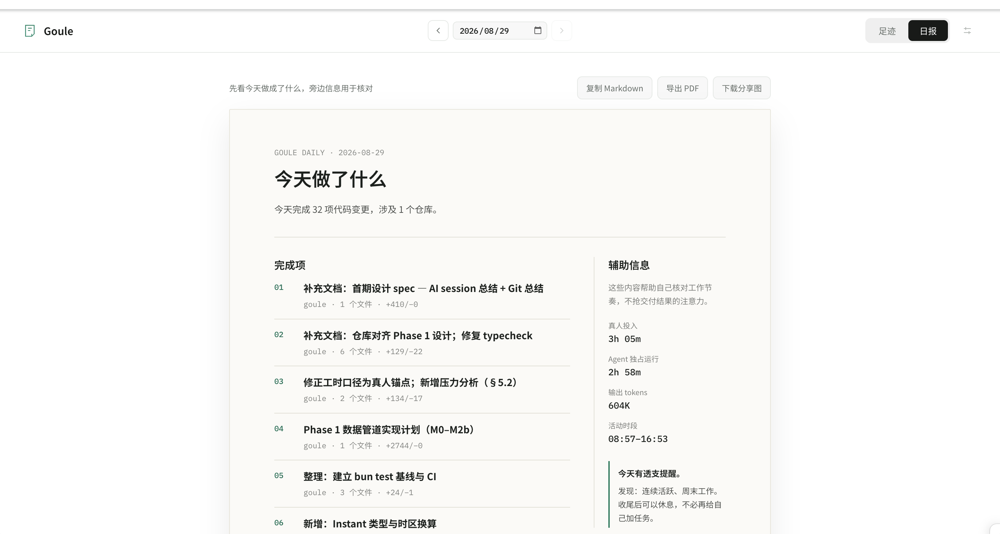

<p align="center">
  
</p>

# Goule · 够了，到点下班

本地工作日报工具。Goule 读取 Git、Claude Code 和 Codex 的本地记录，整理今天完成的事项、投入时段、AI session、代码提交与压力信号，并生成可以直接分享的日报。

数据只在本机处理，不上传源码和对话正文。



## 安装

需要 Node.js 20+ 和 Git 2.30+：

```bash
npm install --global goule
goule
```

默认会生成最近 7 天的数据并打开 Dashboard：

```text
http://127.0.0.1:8912/index.html
```

## 常用命令

```bash
goule                                  # 打开本地 Dashboard
goule dashboard --date 2026-09-01     # 查看指定日期
goule scan --date today               # 输出原始 JSON
goule report --date today             # 输出 Markdown 日报
goule doctor                           # 检查本地数据源
```

日报导出：

```bash
goule report --format html --output report.html
goule report --format pdf --output report.pdf
goule report --format share --output share.png
```

Dashboard 支持日期归档、日报图文展示、PDF 导出和分享图下载。

## 鼠标点击统计

鼠标点击统计默认关闭，目前支持 macOS：

```bash
goule activity start
goule activity status
goule activity stop
```

首次启动需要在“系统设置 → 隐私与安全性 → 辅助功能”中允许终端或 `goule-mouse-helper`。

Goule 只保存按日期和小时聚合的点击次数，不保存坐标、窗口、应用、按键或设备信息。点击次数只作活动参考，不计入工作时长和压力分析。

## 数据与隐私

Goule 当前读取：

- Claude Code session 元数据；
- Codex session 元数据；
- 本地 Git 提交；
- 可选的鼠标点击聚合数据。

本地数据保存在 `~/.goule/`。项目不会读取或上传源码正文、完整 diff、对话正文和按键内容。

## 开发

仓库使用 Node.js 运行 CLI，Bun 仅作为开发期测试工具：

```bash
bun install
npm run dev -- --help
npm run dashboard -- --no-open
npm run typecheck
bun test
npm run build
```

构建产物位于 `dist/index.js`。发布前可以检查 npm 包内容：

```bash
npm pack --dry-run
```

## 自动发布

GitHub Actions 会在 push 和 Pull Request 时使用 Node.js 20、22 完成类型检查、测试、构建和 npm 包检查。

推送与 `package.json` 版本一致的标签后，会自动发布到 npm：

```bash
npm version patch
git push origin main --follow-tags
```

例如 `package.json` 是 `0.0.2`，标签必须是 `v0.0.2`。仓库需要配置名为 `NPM_TOKEN` 的 GitHub Actions secret；发布使用 npm provenance。

## 文档

- [产品需求](docs/PRD.md)
- [Phase 1 设计](docs/superpowers/specs/2026-08-29-goule-phase1-design.md)

## License

[MIT](LICENSE)
