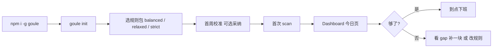

# 够了·到点下班（Goule）— 产品需求文档（PRD）

> 文档版本：**v0.2（决策已冻结）**  
> 更新日期：2026-08-28  
> 目标阶段：`proposal`（待进入 Spec-First 流程）  
> 面向用户：**程序员**（个人开发者、多 repo 工程师、Vibe Coding / AI 辅助开发者）

---

## 文档信息

| 项 | 内容 |
| --- | --- |
| **对外品牌名** | **够了·到点下班** |
| 英文副标题 / GitHub | **Goule** — *Enough, clock out.* |
| CLI / npm 包名 | `goule` |
| 数据目录 | `~/.goule/` |
| 一句话定位 | 本地运行的「今日工作核验 + 日报双模」工具：Git 与可选行为数据，按你定的规则告诉你**够了没有**，并生成可复制的证据页。 |
| 竞品调研基线 | Worktale、git-standup、worklog、ActivityWatch、dev-report、BragDoc、CodeStrain、vibecode-dash 等（2026-08 调研） |

### 品牌与文案口径

| Verdict | 用户可见文案 | 色 |
| --- | --- | --- |
| `GO` | **够了，到点下班** | 绿 |
| `CAUTION` | **差不多，你说了算** | 黄 |
| `NO_GO` | **证据还差点，再补一块** | 红 |

终端 one-liner 示例：`goule check` → `✓ 够了，到点下班（72/100）· 3 commits · 2h14m`

---

## 1. 需求背景

### 1.1 程序员的真实痛点

| 痛点 | 表现 | 现有工具为何不够 |
| --- | --- | --- |
| **下班无凭据** | 加班文化、临时加活、「你今天干了啥」 | git-standup 只列 commit；WakaTime 只计时长，不能回答「够不够」 |
| **日报重复劳动** | 每日复制粘贴 commit、编工时 | dev-report / standup-ai 能写日报，但不产出「下班判定」 |
| **产出不可见** | 绩效、自证、被 PUA「不够饱和」 | BragDoc 偏长期 brag；GitHub Wrapped 偏年度炫技，非日复用 |
| **Vibe Coding 失真** | AI 辅助下「感觉忙了一天」但 evidence 弱 | CodeStrain 管 recovery，不管「今日是否达标」 |
| **数据散落** | Git、IDE、IM、日历各一套 | worklog 聚合强但面向 standup，无规则引擎 |

### 1.2 市场结论（调研摘要）

- **已有红海**：Git → 列表 / AI 日报、本地 heatmap + streak、多源 standup 聚合。
- **明确空白**：**「规则驱动的下班许可 + 双模输出（核验 ↔ 日报）+ 反 PUA 证据页」** 无成熟单品。
- **应吸取的精华**：Worktale 本地隐私、git-standup 多 repo、dev-report 工时映射、ActivityWatch 输入隐私边界、Wrapped 故事化展示、CodeStrain 复合打分。
- **应规避的糟粕**：纯 streak 诱导 fake commit（GitHub 2016 教训）、云端强依赖、读源码/记按键内容、把 AI 幻觉当判定依据。

### 1.3 为什么现在做

- Vibe Coding 普及后，**主观忙碌 ≠ 可验证产出**，程序员更需要「对自己诚实、对外有证据」的工具。
- 本地优先 + SQLite 技术栈成熟（Worktale、gitrakz 已验证）。
- 飞书/IM 元数据在国内职场高频，**开源生态几乎空白**，有本土化窗口。
- **「够了」** 是程序员可共鸣的情绪出口 —— 产品名即价值主张。

---

## 2. 产品愿景与原则

### 2.1 愿景

> **用数据告诉你「够了」，到点下班；不用焦虑替公司 KPI 站岗。**

### 2.2 设计原则

| 原则 | 说明 |
| --- | --- |
| **Local-first** | 默认无账号、无遥测；数据在 `~/.goule/` |
| **Evidence over vibe** | 判定基于可审计信号；AI 仅润色日报，不参与红绿灯 |
| **Rules you own** | 下班规则用户可配置，不硬编码「996 标准」 |
| **Dual face** | 同一数据集：对内核验（短、硬）、对外日报（长、柔） |
| **No keylogger** | 鼠标/键盘只记「有 activity」与计数，不记内容 |
| **Anti-streak-toxic** | 奖励有效产出块，不奖励「为绿块而 commit」 |

---

## 3. 目标用户

### 3.1 核心用户（P0）

**多仓库个人开发者**

- 特征：日切多个 repo；本地 Git 为主；需自写日报或响应「今日进展」。
- 诉求：快速知道「今天算不算够了」、一键复制日报。
- 参考竞品：git-standup、Worktale 用户群。

### 3.2 重要用户（P1）

**Vibe Coding / AI 辅助开发者**

- 特征：Cursor、Claude Code、Copilot 高频；commit 可能少但 session 长。
- 诉求：把 agent session 与 Git 一并纳入「有效工作」证据。
- 参考竞品：vibecode-dash、ship1000x、worklog。

**被 micromanagement / 日报 PUA 的职场程序员**

- 特征：飞书/钉钉日报、晚间「还在吗」、工时质疑。
- 诉求：客观证据页 + 可复制话术，减少情绪内耗。
- 参考竞品：BragDoc 情绪价值 + 本地隐私。

### 3.3 非目标用户（本期）

- 研发团队管理者（要看全员 dashboard）→ 偏 GitClear / git-panorama。
- 纯 HR 考勤 / 法务级工时存证 → 非本产品。
- 不需要 Git 的非技术岗位。

---

## 4. 核心目标

### 4.1 产品目标

1. **30 秒内**完成「今日够了没」核验并给出明确结论（绿 / 黄 / 红 + 一段文字）。
2. **同一数据一键切换**为日报视图，支持复制 Markdown、导出 HTML/PDF。
3. 提供 **「证据向」可视化页**，可用于自我鼓舞或理性自证（非炫耀式 streak）。

### 4.2 业务目标（个人工具 / 开源优先）

- MVP 发布 4 周内：500 GitHub stars 或 100 周活本地用户（二选一作北极星）。
- 核心留存：连续 5 个工作日使用 `goule check` ≥ 30%。

### 4.3 本期判断标准

| 信号 | 阈值 |
| --- | --- |
| 首次配置完成率 | ≥ 70% 能在 10 分钟内跑通首次核验 |
| 核验 → 复制日报转化率 | ≥ 40% 会话内发生 |
| 用户自定义规则率 | ≥ 25% 用户修改默认规则 |
| 负面反馈 | 「误判导致更焦虑」类 issue < 5% |

---

## 5. 用户场景

### 5.1 场景 A：收工前核验（核心）

**触发**：18:00 或 `goule check`  
**流程**：聚合今日 Git → 可选 Activity → 跑规则引擎 → 展示「够了，到点下班」或 gap  
**成功**：用户认可结论并关电脑；或明确知道「差什么」再补 30 分钟。

### 5.2 场景 B：晨报前日报

**触发**：次日 09:30 或 `goule report --mode daily`  
**流程**：读取同一 SQLite 中昨日快照 → 日报模板渲染 → 复制到飞书  
**成功**：≤ 2 分钟完成日报，无需手翻 git log。

### 5.3 场景 C：被质疑时的证据页

**触发**：「你今天产出不够」  
**流程**：打开本地 Dashboard 今日卡片 → 展示 commit 块、有效编码时长、IM 响应摘要 → 导出 HTML  
**成功**：用户用 **事实列表** 回应；产品不提供攻击性话术生成。

### 5.4 场景 D：周末自证 / 反 PUA 自我鼓舞

**触发**：周末 guilt 或自我怀疑  
**流程**：Wrapped 式「今日 Persona + 3 条成就证据」  
**成功**：情绪价值；**不** 鼓励无效 streak。

---

## 6. 功能范围

### 6.1 MVP（v0.1 — 8 周）

#### F1 数据采集层

| 数据源 | 采集内容 | 方式 | 优先级 |
| --- | --- | --- | --- |
| **本地 Git** | commit sha、message、author、time、lines +/-、files、branch、repo | 扫描 + 可选 post-commit hook | P0 |
| **多 repo** | 递归目录、author 过滤、工作日历 | 借鉴 git-standup | P0 |
| **ActivityWatch**（可选） | not-afk 时长、aw-watcher-input 活动计数 | REST import，只读 | P1 |
| **飞书**（可选） | 当日消息数、@ 数、已回复 thread 数（**仅元数据**） | 用户自配 app + OAuth | v0.2 |

#### F2 规则引擎（核心差异化）

**输出**：

- **Verdict**：`GO` | `CAUTION` | `NO_GO`（映射品牌文案见文档信息表）
- **Score**：0–100 产能分（「今日达标度」，非脑疲劳分）
- **Reasons[]**：每条规则命中/未命中，可展开
- **Gap[]**：未满足项 + 建议动作

**默认规则包（`balanced.yaml`，内置 3 套 + 首周校准）**：

```yaml
meta:
  name: balanced
  version: 1

signals:
  git:
    repos: ["~/Projects"]
    author: auto
    exclude_merge: true
  activity:
    enabled: false

rules:
  - id: meaningful_commits
    weight: 40
    pass_if: git.commit_count >= 2
    message: "至少 2 次有效 commit"

  - id: code_volume
    weight: 20
    pass_if: git.lines_changed >= 50
    message: "今日代码变更 ≥ 50 行"

  - id: time_span
    weight: 20
    pass_if: git.active_minutes >= 120
    message: "有效提交时间跨度 ≥ 2h"

  - id: not_only_chore
    weight: 20
    pass_if: git.non_chore_commits >= 1
    message: "至少 1 个非 chore/docs 类 commit"

verdict:
  GO: score >= 70
  CAUTION: score >= 45
  NO_GO: score < 45
```

**chore/docs 判定（已冻结）**：**仅 Conventional Commits 前缀**，不用 LLM。

| 前缀 | 计入「有效产出」 |
| --- | --- |
| `feat` `fix` `refactor` `perf` `test` | ✅ |
| `docs` `chore` `ci` `build` `style` | ❌（可配置 `count_docs: true`） |
| 无前缀 / 其他 | ✅（避免误伤） |

**首周校准向导（已冻结，替代访谈阻塞）**：

- `goule init` 扫描过去 **14 天** Git 历史；
- 取 commit 数、lines changed 的 **P40（偏保守）** 生成 `suggested.yaml`；
- 用户：**一键采纳** / **保持 balanced 默认** / **手动 edit**；
- 不采纳则仍用 `balanced`，不影响主流程。

**规则设计约束**：

- 规则 **必须** 可解释；禁止黑盒 ML 判定下班。
- 支持 `weight` 加权；`veto_rules` 默认关闭。
- 周五宽松 / 周一严格等 schedule override → **v0.2**。

#### F3 双模输出

| 模式 | 受众 | 格式 | 长度 |
| --- | --- | --- | --- |
| **核验结论** | 自己 | verdict 品牌文案 + reasons + gap | 5–10 行 |
| **日报** | 上级 / 团队 | Markdown 表格 + 任务归纳 | 15–40 行 |

**日报结构（默认模板）**：

1. 今日摘要（3 bullet）
2. 完成项（按 repo / 主题聚合 commit）
3. 代码指标（commit 数、lines、files、活跃时段）
4. 明日计划（用户可编辑，默认空）
5. 阻塞项（默认「无」，可编辑）

**切换**：Dashboard Tab 或 `goule report --mode verify|daily`；**同一 `day_id` 快照**。

#### F4 本地 Dashboard

**技术栈（已冻结）**：

| 层 | 选型 | 理由 |
| --- | --- | --- |
| 运行时 | **Bun** | 与 vibecode-dash / Worktale 同类生态；安装快、适合 Vibe Coding |
| API | **Hono** | 轻量、类型友好、挂静态资源简单 |
| 前端 | **React + Vite + Tailwind** | 组件生态成熟，做 Wrapped 式卡片快 |
| 打包 | 单进程 `goule dashboard` | Bun serve API + 内嵌 SPA build；**不用 Electron/Tauri**（MVP 求迭代速度） |
| 安全 | 仅 `127.0.0.1` + 随机 session token | 对齐 vibecode-dash loopback 模型 |

**今日页**：

- 产能分环 + 「够了，到点下班」主文案
- 时间轴：commit 块 + 可选 activity 条
- 「今日证据条」：3 条可写入 brag doc 的成就
- **今日 Persona**（轻量标签）：重构夜 / Fix 猎人 / 文档侠 等
- 复制 Markdown、下载 HTML

#### F5 CLI

```bash
goule init                      # 初始化 ~/.goule，repo 根目录 + 首周校准
goule scan [--date today]       # 手动扫描
goule check                     # 核验结论
goule report [--mode daily]     # 日报
goule dashboard                 # 本地 Web
goule rules edit                # 编辑 rules/*.yaml
```

#### F6 存储

- SQLite（`~/.goule/data.db`）：commits、day_snapshots、rule_runs、user_notes
- 配置：`~/.goule/config.yaml` + `rules/*.yaml`
- **不存**：源码 diff 内容、IM 正文、按键内容

---

### 6.2 v0.2（+4 周）

| 功能 | 说明 |
| --- | --- |
| 飞书元数据接入 | 消息数、@、thread 回复率 |
| ActivityWatch 深度集成 | 有效编码分钟与 Git 交叉验证 |
| AI 日报润色（可选） | 本地 Ollama；**仅改写日报**，不改 verdict |
| 规则市场 | 分享 YAML：`frontend_dev`、`maintainer`、`vibe_coder` |
| PDF / 分享图导出 | 静态 HTML → 图片 |

---

### 6.3 v0.3（愿景）

| 功能 | 说明 |
| --- | --- |
| Claude/Cursor session 导入 | 参考 worklog |
| 周报复用 | 5 个 day_snapshot 聚合 |
| 定时提醒 | 「当前 CAUTION，还差 1 条 meaningful_commits」 |

---

### 6.4 明确不做（范围外）

- ❌ 云端账号、团队 leaderboard、公开 profile
- ❌ 读取源码内容或完整 diff 送 LLM
- ❌ 键盘记录 / 屏幕截图
- ❌ 替用户自动发飞书（MVP 仅复制）
- ❌ 强制工时算法（如必须 9h）
- ❌ 面向管理者的员工监控

---

## 7. 交互与信息架构

### 7.1 页面结构

```
/ today          今日核验（默认）— 「够了·到点下班」主视觉
/ report         日报编辑与预览
/ history        历史日快照
/ rules          规则配置（v0.2 YAML 可视化）
/ settings       repo、数据源、隐私
```

### 7.2 首次使用流程



---

## 8. 非功能需求

### 8.1 隐私与安全

| 项 | 要求 |
| --- | --- |
| 绑定地址 | 仅 `127.0.0.1`；随机 token gate |
| 数据出境 | 默认零网络 |
| 飞书 | 只拉 metadata；不存正文 |
| 卸载 | 删除 `~/.goule` 即清除 |

### 8.2 性能

- 10 repo / 1 万 commit 冷扫描 < 30s；增量 < 3s
- Dashboard 首屏 < 2s

### 8.3 兼容

- macOS / Linux 优先；Windows Git Bash 次之
- Git 2.30+；Bun 1.1+

---

## 9. 竞品差异化

| 维度 | 够了·到点下班 | 最近竞品 |
| --- | --- | --- |
| 核心动作 | **「够了没」** | 列 commit / 写 standup |
| 判定 | **规则引擎** | 无或纯 AI |
| 输出 | **核验 + 日报双模** | 单模 |
| 情绪 | **「到点下班」证据页** | BragDoc 长期 / Wrapped 年度 |
| 本地化 | **飞书 metadata**（v0.2） | Slack 为主 |
| 隐私 | `~/.goule` 本地 | 混合 |

---

## 10. 成功指标与埋点

> 默认无遥测；`goule config set telemetry opt-in` 可选匿名统计。

| 指标 | 定义 |
| --- | --- |
| TTV | install → 首次 verdict < 10 min |
| 核验周活 | 7 天内 ≥ 3 次 `check` |
| 日报复制率 | report 视图 copy / 打开 |
| 规则定制率 | 修改过 rules 的用户占比 |

---

## 11. 商业模式

| 阶段 | 模式 |
| --- | --- |
| MVP | **MIT 开源** + CLI + Dashboard |
| 后续可选 | Pro：飞书模板、PDF 主题、加密云备份（opt-in） |

---

## 12. 风险与对策

| 风险 | 对策 |
| --- | --- |
| 规则误判引发焦虑 | CAUTION 区间宽；文案「你定的规则」；首周校准 |
| 刷 commit 骗 GO | anti-gaming 文档；`min_files_per_commit` 可选 |
| Bun 生态偏新 | 核心扫描用 TypeScript + `simple-git`；Bun 仅作 runtime |
| 飞书 API | v0.2；MVP 不阻塞 |

---

## 13. 里程碑

| 阶段 | 时间 | 交付 |
| --- | --- | --- |
| M0 | W1–2 | Git 扫描 + SQLite + rules 引擎 |
| M1 | W3–4 | `check` / `report` + 3 规则包 + 首周校准 |
| M2 | W5–6 | Dashboard（Bun + Hono + React） |
| M3 | W7–8 | 文档、安装、内测 |
| **v0.1** | W8 | 公开发布 **goule** |
| v0.2 | +4W | 飞书 + AW + Ollama |

---

## 14. 决策记录（已冻结 — 2026-08-28）

| # | 议题 | 决策 |
| --- | --- | --- |
| 1 | **正式名称** | 对外：**够了·到点下班**；工程/GitHub：**Goule**；CLI：`goule` |
| 2 | **默认规则阈值** | 采用 `balanced` 默认值；**首周校准**用 14 天 Git P40 建议，不阻塞 MVP |
| 3 | **chore 分类** | **仅 Conventional Commits 前缀**；LLM 不参与 verdict |
| 4 | **Dashboard 技术栈** | **Bun + Hono + React/Vite/Tailwind**；loopback only；不用 Electron/Tauri |
| 5 | **开源协议** | **MIT** |

---

## 15. 附录：默认规则包

| 包 ID | 适用 | 特点 |
| --- | --- | --- |
| `balanced` | 普通 feature 日 | 2 commit + 50 lines + 2h 跨度 |
| `relaxed` | 维护 / 调研 | 1 commit 或 30min AW 深度块 |
| `strict` | 赶版本 | 3 commit + 100 lines |
| `vibe_coder` | AI 辅助 | 降 commit 权重（v0.3） |

---

## 关联文档

- 竞品调研：会话记录 2026-08-28
- 前版 PRD：`reports/prd-offduty-work-verification-tool.md`（已 supersede）
- 后续：`spec/be/`、`spec/fe/`、`design/`
