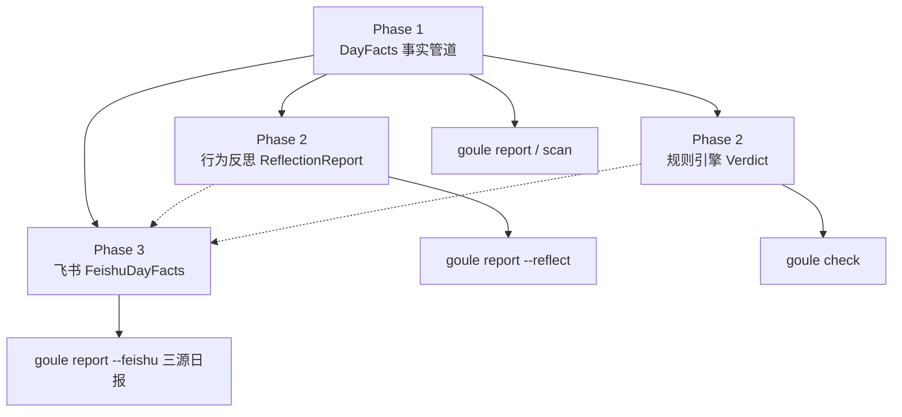

# Goule 首期设计：AI Session 总结 + Git 总结

> 文档版本：v1.1
> 日期：2026-08-29（Phase 2/3 路线图：2026-08-29 增补）
> 阶段：Phase 1 设计（已评审冻结项见 §3）；Phase 2/3 为规划项，未冻结
> 上游：`docs/PRD.md` v0.2

---

## 1. 首期范围

一句话：**读取本机 Claude Code 与 Codex 的 session 元数据、结合本地 Git 提交，产出一份「今天干了什么」的结构化日报**。

首期**不做判定**。没有红绿灯、没有分数、没有规则引擎。只做事实的采集、关联与呈现。

### 1.1 与 PRD 的偏离（需知悉）

PRD v0.2 把 session 导入排在 v0.3、AI 总结排在 v0.2，而把规则引擎与 Dashboard 放进 v0.1 MVP。本期**主动重排**了这个顺序：

| PRD 原排期 | 本期决定 | 理由 |
| --- | --- | --- |
| v0.1：Git + SQLite + 规则引擎 + Dashboard | 推迟 | 规则引擎的价值取决于「阈值定得准不准」，而阈值需要真实数据来标定。先有数据管道，规则才有依据 |
| v0.3：Claude/Cursor session 导入 | **提前到首期** | 本机实测 CC 189 + Codex 255 个 session，是比 Git 更完整的工作证据；且 session↔commit 的关联是竞品都没有的差异化 |
| v0.2：AI 日报润色 | **提前到首期（可选层）** | 实测 Codex session 无标题、CC 也有缺失，润色层的真实职责是「补缺失标题」而非「改写得好听」 |

PRD 的原则不变：Local-first、Evidence over vibe、No keylogger、不读源码送 LLM。本期新增一条落地规则见 §8。

### 1.2 明确不做（Phase 1）

- 行为反思、会话语义分析（Phase 2，见 §13）
- 规则引擎、verdict、产能分（Phase 2，见 §13.4）
- Web Dashboard、SQLite（Phase 2 及以后，按需引入）
- 飞书接入与 IM 总结（Phase 3，见 §14）
- Cursor（`state.vscdb` 为未公开 schema，随版本碎；成本高一档）
- ActivityWatch（维持 PRD 排期，Phase 2+ 可选）
- 任何形式的云端账号、遥测、替用户自动发飞书

---

## 2. 实测基线（2026-08-29，本机）

设计中的每个数值均来自实测。测量口径：逻辑日 `2026-08-28`（跨 8/28–8/29 两个自然日）。

| 观测 | 数值 | 对设计的影响 |
| --- | --- | --- |
| 候选文件总数 | **438** = CC 顶层 102 + CC subagent 85 + Codex 251 | subagent 占 CC 文件的 45%，`discover` 必须递归 |
| mtime 预过滤命中 | 438 → **25** 个文件（2 ms） | 预过滤是性能的第一来源 |
| 当日数据量 | **283 MB / 39277 条记录** | 绝大部分是对话正文与代码，而我们只需元数据 |
| 全量 `JSON.parse` 耗时 | **1073 ms** | 朴素解析可行但浪费 27 倍 |
| 流式正则 + 选择性解析 | **124 ms**（8.7x） | 采纳为 L1 实现策略，见 §6.4 |
| **真人输入占全部记录** | **8.89%**（15641 / 175901） | 「有记录」≠「人在工作」，见 §4.3 |
| **误用全部记录当工时** | 近 30 天 163 h vs 真实 100 h，**虚高 63%**；单日最高虚高 **7.3×** | `active_minutes` 必须锚定真人输入 |
| 单个 session 文件极值 | **466 MB / 跨 13 天 / 45117 条记录**，其中真人输入仅 150 条 | session 文件会被 resume 持续追加，且多为 agent 自动记录 |
| 记录间隔 P50 / P99 | 0.1 s / 72.8 s | 活跃时记录极密，idle 阈值有充足余量 |
| 裸 span 合计 | 4453 h（含单个 1038 h 的 session） | first→last 完全不可用作时长 |
| 活跃时长 / 裸 span | 4%–9%（阈值 2–60 min 区间） | 阈值不敏感，不值得投入调参 |
| 并行 session 双重计时 | 817 → 776 min，虚高 5% | 必须做区间并集（正确性问题） |
| 跨午夜工作块 | 存在 448 min 块，17:52 → 次日 01:20 | 必须引入逻辑日边界 |
| 零时长块占比 | 19 块中 7 块为 0 min | 需要最小块信用 |

> 记录：早期一次测量得出「40 ms」，系因当时仅扫描 8/29 单日（数据尚薄）且 glob 未递归、漏掉全部 subagent 文件。上表为修正后的口径。

## 3. 已冻结决策

| # | 议题 | 决策 |
| --- | --- | --- |
| 1 | 首期目标 | AI session 总结 + Git 总结，不做 verdict |
| 2 | 数据源 | Claude Code + Codex，不含 Cursor |
| 3 | 总结生成方式 | 两层：事实层（无 LLM）+ 可选润色层 |
| 4 | 存储架构 | **无状态现扫**；仅持久化用户笔记 |
| 5 | adapter 接口 | 取字段**并集** + 可空，不取交集 |
| 6 | 逻辑日边界 | `day_cutoff_hour` 默认 04:00 本地时间 |
| 7 | idle 阈值 | `idle_gap_minutes` 默认 10 |
| 8 | **工时口径** | 拆为 `hands_on_minutes`（真人输入锚定，唯一工时口径）与 `agent_minutes`（agent 自主运行，产出杠杆指标），**不得混算** |
| 9 | **压力分析定位** | 压力**降低「够了」的门槛**，不单独出分。信号计算属 Phase 1，门槛折扣属 Phase 2 |

### 3.1 为何不上 SQLite

SQLite 唯一不可替代的价值是存储**无法从源头重建的数据**。首期的数据全部可重建：session 文件与 Git 历史都不可变，今天扫和下个月扫结果一致。124 ms 的扫描成本也不构成缓存动机。

唯一不可重建的是用户手写的笔记（明日计划、阻塞项），用单个 JSON 文件即可。

升级触发条件是明确的：**当规则引擎引入、且规则本身会随时间修改时**，「用当时的规则算出的当时的结论」第一次变得无法重建。那时引入快照层（`~/.goule/snapshots/`），若跨天聚合出现性能问题再升 SQLite。在此之前提前建表属于为未写的代码预留结构。

---

## 4. 逻辑日与活跃块

### 4.1 逻辑日

```
day_id "2026-08-28"  ≡  [2026-08-28 04:00, 2026-08-29 04:00)  本地时区
```

`day_cutoff_hour` 默认 `4`，可配置为 `0` 恢复自然日。

依据：实测存在 17:52 干到次日 01:20 的连续 448 分钟工作块。按自然日切会把它腰斩，使「今天」的统计从根上失真。程序员的一天不在午夜结束，把这个领域事实编码进模型，而不是让用户自己脑补。

跨边界的块按边界**裁剪**，两侧各计各的，不整块归属。

### 4.2 时区

- session timestamp 为 UTC（形如 `2026-08-29T01:36:35.902Z`）
- git timestamp 带本地 offset
- **内部一律存 UTC instant**，仅在切日与展示时转本地时区
- 时区取系统时区，可用 `GOULE_TZ` 覆盖

此处是最易埋雷的位置，类型层面区分 `Instant`（UTC 瞬时）与 `LocalDateTime`，禁止隐式转换。

### 4.3 切块算法

**锚点是真人输入事件，不是全部记录。** 这是本节最重要的约束，理由见下。

```
输入：RawSession[]
1. 从 events 中筛出 kind == 'human'（真人输入）→ 得到锚点序列
2. 每个 session 内按锚点时间排序
3. 相邻锚点间隔 > idle_gap_minutes(10) 则断开 → 得到该 session 的块
4. 块时长 = last - first；若为 0，计 min_block_credit(60s)
5. 收集所有 session 的所有块，跨工具做区间并集(interval union)
6. 按逻辑日边界裁剪
7. hands_on_minutes = 并集后各块时长之和
```

- **步骤 1 是正确性的根基。** 实测真人输入仅占全部记录的 **8.89%**（15641/175901）。若以全部记录为锚点，近 30 天算出 163 h，而真实 hands-on 是 100 h，**虚高 63%**；单日最坏虚高 **7.3 倍**（2026-08-13：1123 min vs 153 min）。对一个核心命题是「够了，到点下班」的产品，这等于在用户实际动手 2.6 小时的那天告诉他「你干了 18.7 小时」。
- **步骤 2 按文件聚合，不按记录**：Codex 的 `session_meta` 仅出现在首行，按记录聚合会碎成大量单记录幽灵 session。
- **步骤 5 的并集是正确性要求**：并行开多个窗口时，分别求和再相加会虚高（实测 5%）。subagent 的块必然与父 session 重叠，同样由并集处理。
- **步骤 4 的最小信用**：单锚点块代表一次真实交互，计 0 不诚实；但也不应让它冒充工作块，故给固定小额信用。

阈值选择：P99 记录间隔为 73 秒，10 分钟有 8 倍余量。实测 2→60 分钟的阈值扫描中结果始终在同一数量级，该参数不敏感，不值得投入调参。

#### 真人输入的判别

| 工具 | 谓词 |
| --- | --- |
| Claude Code | `type == "user"` 且 `userType == "external"` 且 `isSidechain != true`，且 message.content 非 `tool_result` |
| Codex | `payload.role == "user"`（排除 `developer` / `assistant`） |

CC 的 `tool_result` 同样以 `type: "user"` 落盘，**必须排除**，否则仍会把 agent 循环计入工时。实测用粗谓词（未排除 tool_result）得到的 100 h 是 hands-on 的**上界**，精确谓词会进一步收敛。此谓词是 L1 的核心逻辑，须有针对性 fixture 测试。

### 4.4 agent 时长单独建模

`agent_minutes` = 以**全部记录**为锚点、同样切块并集后的时长，减去 `hands_on_minutes` 的部分。

它不是工时，但是有价值的证据：PRD 的 P1 用户正是「commit 可能少但 session 长」的 Vibe Coder，agent 自主运行时长是**产出杠杆**的度量。两者并列呈现、永不相加：

- 「够了没」的判定（Phase 2）与压力分析（§5.2）**只能用 `hands_on_minutes`**
- 日报中 `agent_minutes` 作为独立一行呈现，措辞须避免暗示其为工时

实测极端案例：单个 Codex rollout 文件 466 MB、跨 13 天、45117 条记录，其中真人输入 150 条。若不做此区分，该文件会独自贡献 18.7 小时的虚假工时。

---

## 5. `DayFacts` 数据契约

`DayFacts` 是首期的核心契约，同时承担三个角色：事实层的输出、润色层的**唯一**输入、未来规则引擎的输入。

```jsonc
DayFacts {
  schema_version: 1,
  day_id: "2026-08-28",
  boundary: { start: Instant, end: Instant, cutoff_hour: 4, tz: "Asia/Shanghai" },
  generated_at: Instant,

  activity: {
    hands_on: {                             // ★ 唯一工时口径，真人输入锚定
      blocks: [{ start: Instant, end: Instant, minutes: number,
                 sources: ToolId[] }],      // 已做区间并集
      minutes: number,
      by_hour: number[24]                   // 分钟/小时，供热力条
    },
    agent: {                                // 产出杠杆指标，非工时，永不与上者相加
      blocks: [...],
      minutes: number
    }
  },

  stress: { /* 见 §5.2 */ },

  ai: {
    sessions: [{
      id: string,
      tool: "claude-code" | "codex",
      title: string | null,                 // CC 的 aiTitle；缺失为 null
      repo: string | null,                  // 由 cwd 解析
      branch: string | null,
      cwd: string | null,
      minutes: number,
      blocks: [{ start, end, minutes }],    // 本 session 自己的块，未并集
      turns: { user: number, assistant: number },
      models: string[],
      tokens: { in, out, cache_read } | null,
      is_sidechain: boolean,                // subagent
      parent_session_id: string | null      // subagent 指向父 session
    }],
    totals: { sessions, minutes, user_turns, tokens }
  },

  git: {
    repos: [{
      path: string, name: string, branch: string,
      commits: [{
        sha, ts: Instant, subject: string,
        type: string | null, scope: string | null,   // Conventional Commits 前缀
        files: number, insertions: number, deletions: number,
        is_merge: boolean
      }]
    }],
    totals: { commits, files, insertions, deletions, repos }
  },

  joined: [{
    repo: string, branch: string | null, minutes: number,
    session_ids: string[], commit_shas: string[],
    confidence: "exact" | "heuristic"
  }],

  unattributed: {
    sessions: SessionRef[],   // cwd 不在任何已知 repo 内
    commits:  CommitRef[]     // 时间上无 session 覆盖（IDE 内直接提交等）
  },

  notes: { tomorrow: string, blockers: string }
}
```

### 5.1 三个设计要点

**`title: null` 是显式建模。** 实测 Codex 全部无标题、CC 亦有缺失。若用空串或兜底文案填充，润色层就无法知道该补哪几个。把缺失如实建模，是两层方案的价值落点。

**`unattributed` 是一等公民。** 实测存在 `cwd=$HOME`、`branch=HEAD` 的 session，无法关联任何 repo。静默丢弃是这类工具最主要的失信来源——用户确实干了活，工具却说没有。宁可显示「3 个 session 未能关联到 repo」也不假装它们不存在。

**`joined` 是首期唯一不可替代的输出。** git-standup 给 commit 列表，worklog 给时长，没有工具能给出「在 `acme-api/master` 上，2 个 AI session（164 min）产出了 5 个 commit」。首期若只交付一样东西，是这个。

### 5.2 压力信号

压力分析的定位（冻结决策 #9）：**压力降低「够了」的门槛，不单独出分。**

不出独立分数是刻意的。PRD §12 已把「规则误判引发焦虑」列为首要风险，而一个说「你压力 78 分」却不给动作的数字，只会变成又一个自我鞭挞的指标——与产品的反 PUA 立场直接冲突。让压力成为**下班的理由**，才是这个产品该有的形状。

**全部信号锚定 `hands_on_minutes`。** agent 跑一整夜不会让人疲劳，用错口径会凭空制造压力：实测模型 A 会把本机数据描绘成「3 天深夜工作、日均 6.5 h」的 workaholic，而真实 hands-on 是规律的 3.5 h。

| 信号 | 定义 | 默认阈值 | 本机 36 天实测触发 |
| --- | --- | --- | --- |
| `late_night` | 23:00–06:00 的 hands_on 分钟 | > 30 min | **1 / 36 天** |
| `past_midnight` | 工作块跨越 00:00 | — | 2 / 36 天 |
| `short_recovery` | 昨日末锚点 → 今日首锚点的间隔 | < 8 h | 1 / 29 天 |
| `consecutive_days` | 连续有活动的逻辑日 | ≥ 6 天 | 2 次 |
| `overlong_day` | hands_on 超**个人** P90 | 个人基线（本机 384 min） | 按定义 ~10% |
| `weekend_work` | 周末 hands_on | > 60 min | 1 / 10 个周末日 |
| `no_break_block` | 单个连续块无间断时长 | > 120 min | — |

`overlong_day` 用**个人历史 P90** 而非硬编码工时，直接落实 PRD 的「Rules you own，不硬编码 996 标准」——基线是用户自己的分布，不是别人的标准。历史不足 14 天时该信号不参与，避免新用户被无意义基线误判。

**压力债模型：**

```
debt = Σ_signal  weight(signal) × 0.5 ^ (days_ago / half_life_days)
```

`half_life_days` 默认 3。用半衰而非「连续 N 天」窗口，因为恢复是渐进的：昨天熬夜比三天前熬夜欠得多，而三天前的透支不应突然归零。

```jsonc
stress: {
  signals: [{ id, fired: boolean, value: number, threshold: number, days_ago: number }],
  debt: number,                       // 归一到 0..1
  baseline: { hands_on_p90: number, window_days: 30, sufficient: boolean }
}
```

**Phase 归属**：信号与 `debt` 的计算属 **Phase 1**——它们是可审计的事实，天然属于 `DayFacts`。消费 `debt` 去调整门槛属 **Phase 2**（规则引擎），见 §12。

**呈现规则**：措辞必须是下班的理由，不是待改进的指标。「你昨天工作到 01:20，今天这些就够了」——而非「你的压力指数是 78」。

**一条设计验证**：本机 36 天数据里，`late_night` 只触发 1 次、`short_recovery` 1 次。一个在作息健康的用户身上疯狂报警的压力分析就是坏的；这份数据表明信号阈值选对了。

---

## 6. 模块边界

```
L1  adapters/{claude-code,codex}   →  RawSession[]       纯解析，零业务判断
L2  timeline/                      →  ActivityBlock[]    切块 + 并集 + 逻辑日
L3  git/                           →  RepoDay[]          git log + CC 前缀分类
L4  join/                          →  DayFacts           关联 + 孤儿桶
L5  render/                        →  Markdown           事实层输出
L6  polish/                        →  Markdown           可选，唯一触网的层
```

单向依赖，每层只依赖下游的**类型**而非实现。L1–L4 为纯函数：不读时钟、不触网、不依赖全局状态，输入确定则输出确定。

### 6.1 adapter 接口

```ts
interface SessionAdapter {
  readonly tool: ToolId
  discover(range: DayRange): Promise<Candidate[]>   // mtime/路径预过滤
  parse(c: Candidate): Promise<RawSession>
}

interface RawSession {
  id: string
  tool: ToolId
  file: string
  events: { at: Instant; kind: 'user' | 'assistant' | 'meta' | 'other' }[]
  cwd: string | null
  git: { branch: string | null
         commitHash: string | null
         remoteUrl: string | null } | null
  title: string | null
  models: string[]
  tokens: TokenUsage | null
  turns: { user: number; assistant: number }
}
```

**接口取并集而非交集。** 若取最小公共子集，`aiTitle`（CC 独有）与 `commitHash`（Codex 独有）都会被砍掉，接口看似干净，但每接入一个新工具信息就少一分。取并集 + 字段可空，每个 adapter 尽力提供、消费方显式处理缺失，能力只增不减。

各工具实际能力：

| 字段 | Claude Code | Codex |
| --- | --- | --- |
| cwd | 每条记录 | `session_meta.cwd` |
| branch | 每条记录 `gitBranch` | `session_meta.git.branch` |
| commitHash | 无 | `session_meta.git.commit_hash` |
| remoteUrl | 无 | `session_meta.git.repository_url` |
| title | `ai-title` 记录的 `aiTitle` | 无 |
| tokens | `message.usage` | `event_msg.token_count` |
| subagent | 独立文件 + `isSidechain` / `agentId` / 父 `sessionId` | 无（未观测到） |

### 6.2 join 的两档精度

精度差异显式声明，不静默降级：

| 条件 | 策略 | `confidence` |
| --- | --- | --- |
| 有 `commitHash`（Codex） | 以 `commitHash..HEAD` 的 rev range 归属提交 | `exact` |
| 仅有 branch（CC） | `(repo, branch, 时间窗重叠)` 启发式 | `heuristic` |

### 6.3 `discover` 的预过滤

性能的第一来源（438 → 25 文件，2 ms）。规则：

- **Claude Code**：`~/.claude/projects/**/*.jsonl`（**必须递归**）
  - 顶层 `<project>/<uuid>.jsonl` 为主 session
  - `<project>/<uuid>/subagents/agent-*.jsonl` 为 subagent，实测占 85/187 = 45%。两层 glob 会静默漏掉近半数文件
  - subagent 记录含 `isSidechain: true`、`agentId`，其 `sessionId` 即父 session id
- **Codex**：`~/.codex/sessions/YYYY/MM/DD/*.jsonl`
  - 先按目录日期筛（覆盖逻辑日跨越的 2 个自然日），再按 mtime 复筛
  - `~/.codex/` 根目录下的 `history.jsonl`、`session_index.jsonl`、`transcription-history.jsonl` **不是** session 文件，四层 glob 天然排除，勿改用递归
  - `session_index.jsonl` 实测仅 16 行 vs 251 个 session 文件，索引不完整，**不可用于 discover**

mtime 窗口左侧放宽 1 天，避免逻辑日 04:00 边界与跨午夜 session 造成漏扫。预过滤只用于缩小候选集，最终归属一律以记录内 timestamp 为准。

**subagent 的时间块必然与父 session 重叠**（subagent 在父 session 运行期间执行）。区间并集（§4.3 步骤 4）已正确处理时长；但 `ai.totals.sessions` 计数时须排除 `is_sidechain: true` 的条目，否则 session 数虚高。

### 6.4 解析策略

朴素地对 283 MB 逐行 `JSON.parse` 需 1073 ms，且绝大部分开销花在解析我们根本不读的 `message.content`（对话正文与代码）。采用两级策略，实测 **124 ms（8.7x）**：

1. **时间轴**：流式逐行，用正则 `/"timestamp":"(\d{4}-\d\d-\d\dT[^"]{4,32})"/` 提取**每行第一个**匹配，不做 JSON 解析。
2. **元数据行**：仅当行内匹配 `ai-title` / `session_meta` / `token_count` 时才做完整 `JSON.parse`。实测当日仅 4914 行需要（占 12.5%）。

准确性实测：

| 策略 | 相对真值 |
| --- | --- |
| 取每行**第一个**匹配 | **100.00%**（37726/37726） |
| 取每行最后一个匹配 | 99.97% |

正则整体召回 100%，但存在 0.26% 假阳性——出现在**本身没有 timestamp 字段**的记录（`ai-title` / `mode` / `last-prompt` 等）中，其正文恰好包含形如 `"timestamp":"..."` 的字符串。防护：提取到的时间戳须落在 `[文件 mtime - 30d, now]` 内，否则丢弃。这些记录本就不参与时间轴，影响可忽略。

此优化只影响 L1 的**实现**，不改变其接口与输出，故可在 M1 先以朴素 `JSON.parse` 实现、测试通过后再替换，由同一组 fixture 测试保证等价。

## 7. CLI

首期命令面：

```bash
goule report [--date today] [--format md|json] [--polish] [--dry-run]
goule scan   [--date today]        # 输出原始 DayFacts JSON，供调试与管道
goule notes  [--date today]        # 用 $EDITOR 打开当日笔记
goule doctor                       # 数据源可达性诊断（P1）
```

两个待评审确认的口子，本文档按下述倾向写入：

- **`check` 首期不实现。** 首期无规则引擎，`check` 只能是空壳；保留它会让用户误以为存在判定能力。`--help` 中标注为 Phase 2。品牌核心动作在 Phase 2 规则引擎落地时归位。
- **notes 用 `$EDITOR`。** 明日计划与阻塞项是多行自由文本，命令行参数不合适。落盘为 `~/.goule/notes/YYYY-MM-DD.json`。

`doctor` 定为 P1（可砍）。理由：本产品依赖两个外部工具的私有目录，「装完跑不通」是最可能的首次使用失败模式，而 PRD 的 TTV 指标（10 分钟内首次跑通）直接依赖可诊断性。实现成本约数十行。

---

## 8. 润色层与隐私契约

### 8.1 风险面

`DayFacts` 已不含对话正文（adapter 只提元数据），但仍包含：绝对路径（`/Users/<user>/work/acme-api`）、暴露内部系统的分支名（`feature-<内部系统名>-limit-<中间件名>`）、私有仓库地址（`git@<企业 git 域名>:<org>/acme-api.git`）、以及 commit subject 中可能存在的客户名与工单号。

### 8.2 `PolishInput` 是投影，不是别名

| 档位 | 包含 | LLM 可达质量 |
| --- | --- | --- |
| `strict`（默认） | 数字指标、时间块、匿名 repo 别名（`repo-1`） | 仅能生成骨架 |
| `standard`（需显式开启） | 追加 repo 名、branch 名、commit subject | 可补出可用标题与日报 |

**两档均不发送**：绝对路径、cwd、sha、remoteUrl、token 数、model 名。这些对润色无帮助，纯粹是风险。

### 8.3 两条强制规则

1. **`--dry-run` 打印将发送的完整 payload。** 不以「我们很安全」的承诺代替可验证性；由用户自己看见送了什么。首次切换到 `standard` 时强制走一次该流程并确认。
2. **LLM 生成内容在输出中必须可区分。** 补出的标题标注 `*`，脚注写明「标 `*` 的条目由模型生成，非事实记录」。否则用户复制进日报的幻觉内容会被当作证据，直接违背 PRD「Evidence over vibe」原则。**事实层输出必须在任何时候都能独立成立**，润色是叠加层，不是替代层。

### 8.4 Provider

`PolishProvider` 为接口，首期默认关闭。两个实现：本地 Ollama、兼容 OpenAI 的 HTTP endpoint。配置于 `~/.goule/config.yaml`。无配置时 `--polish` 报错并提示配置路径，不静默降级。

---

## 9. 配置与数据目录

```
~/.goule/
  config.yaml                  # 见下
  notes/YYYY-MM-DD.json        # 用户笔记
  activity/YYYY-MM-DD.json     # 可选鼠标活动聚合（无原始事件）
```

```yaml
day_cutoff_hour: 4
idle_gap_minutes: 10
min_block_credit_seconds: 60
timezone: auto                 # 或 IANA 名
sources:
  claude_code: { enabled: true, root: ~/.claude/projects }
  codex:       { enabled: true, root: ~/.codex/sessions }
mouse:
  enabled: false
  provider: auto
  persist: true
git:
  repos: ["~/work", "~/projects"]   # 递归扫描根
  author: auto                              # 取 git config user.email
  exclude_merge: true
stress:
  half_life_days: 3
  late_night_window: [23, 6]        # 本地时
  late_night_minutes: 30
  short_recovery_hours: 8
  consecutive_days: 6
  weekend_minutes: 60
  no_break_block_minutes: 120
  baseline_window_days: 30
  baseline_min_days: 14             # 不足则 overlong_day 不参与
polish:
  enabled: false
  provider: ollama
  redaction: strict
```

`~/.goule` 可整体删除，无残留。

### 9.1 鼠标点击活动（可选扩展）

鼠标点击作为独立的活动证据接入，不改变 `hands_on` 的真人 session 锚定口径，也不直接
参与压力信号或规则判定。默认关闭，用户显式执行 `goule activity start` 后才开始采集。

内部事件只保留 `{ at: Instant }`；持久化只保存按逻辑日和本地小时聚合的结果：

```jsonc
activity.mouse_clicks {
  enabled: boolean,
  clicks: number,
  by_hour: number[24],
  observed_minutes: number,
  coverage: "complete" | "partial" | "unavailable",
  provider: "macos-cgevent" | "linux-evdev" | "activitywatch"
}
```

不保存坐标、窗口/应用名、屏幕信息、设备信息、鼠标移动或原始事件序列。第一版只支持
macOS Core Graphics Event Tap；采集器以原生 helper 运行，Bun 进程负责聚合和原子写入
`~/.goule/activity/YYYY-MM-DD.json`。权限不足、睡眠或 collector 中断时必须标记
`coverage: "partial" | "unavailable"`，不能把未采集误报为 0 次点击。

日报中可以展示点击次数，但措辞必须明确它是活动参考，不等于工作时长；未来即使与
`hands_on` 做融合，也必须先经过真实数据校准并保持可解释。

---

## 10. 测试策略

| 层 | 方式 |
| --- | --- |
| L1 adapters | 基于**脱敏 fixture**。`scripts/make-fixture.ts` 读真实 session 文件、剥除所有 `content` 字段、保留 type/timestamp/结构骨架 |
| L2 timeline | 纯算法单测，手工构造 timestamp 序列。必须覆盖：跨午夜块、并行重叠块、零时长块、逻辑日边界裁剪 |
| L2 真人谓词 | **专项 fixture**：CC 的 `tool_result`（同为 `type: "user"`）、subagent 记录、Codex 的 `developer` role 均须被排除。断言 hands_on 不受 agent 循环长度影响 |
| L2 stress | 纯算法单测：各信号阈值边界、半衰衰减、基线不足时 `overlong_day` 关闭。**回归断言：本机 36 天样本上 `late_night` 触发 ≤ 2 次**——过度触发即为回归 |
| L3 git | 在临时目录 `git init` 并造提交，不依赖真实仓库 |
| L4 join | 组合测试，重点覆盖 `exact` / `heuristic` 两档与孤儿桶 |
| L5 render | Markdown 快照测试 |
| L6 polish | provider 打桩；**独立断言 `PolishInput` 不含 §8.2 的禁发字段** |

**脱敏 fixture 脚本本身即是隐私边界的第一道验证**：若剥除全部 `content` 后 L1–L4 测试仍全绿，即证明这四层确实只依赖元数据。这条性质应作为 CI 断言，而非口头约定。

性能回归基线：当日全量扫描 **< 500 ms**（实测 124 ms，留 4 倍余量）。朴素 `JSON.parse` 实现为 1073 ms，超预算，故 §6.4 的解析策略是**功能需求**而非可选优化。

---

## 11. 里程碑

| 阶段 | 交付 |
| --- | --- |
| P1-M0 | 类型定义（`DayFacts` / `RawSession`）+ 脱敏 fixture 脚本 + CI |
| P1-M1 | L1 两个 adapter（含 CC subagent 递归发现），通过 fixture 测试；先朴素实现，再落 §6.4 优化 |
| P1-M2 | L2 timeline（真人锚点切块 / 并集 / 逻辑日 / hands_on-agent 拆分），含全部边界用例 |
| P1-M2b | 压力信号与压力债计算（§5.2），含个人基线冷启动 |
| P1-M3 | L3 git 扫描 + L4 join，产出完整 `DayFacts` |
| P1-M4 | L5 render + `goule report/scan/notes`，事实层可用 |
| P1-M5 | L6 polish（可选层）+ `--dry-run` + 隐私断言 |

M4 即为首期的可用交付点；M5 为增强。

---

## 12. 路线图总览

| 阶段 | 一句话 | 核心交付 | 依赖 |
| --- | --- | --- | --- |
| **Phase 1** | 事实采集与关联 | `DayFacts` + 事实层日报 | — |
| **Phase 2** | 行为反思 + 产能判定 | `ReflectionReport` + `Verdict`（含压力债门槛折扣）+ `goule check` | Phase 1 管道 + 可选本地 LLM |
| **Phase 3** | 协作上下文补全 | 飞书聊天总结 + 三源 join 日报 | Phase 1 + 用户 OAuth |

Phase 1 的 `DayFacts` 契约在各阶段**只增不改**——新阶段通过扩展字段或并列契约追加能力，不回写 Phase 1 语义。

---

## 13. Phase 2：行为反思层 + 规则引擎

> 状态：规划项，未冻结。本节描述方向与边界，实施前需单独评审。

### 13.1 目标

在 Phase 1 的**硬事实**之上，增加一层**可解释的软洞察**：帮助用户看见工作模式（例如在同一问题上反复与 AI 拉锯），并给出可操作的改进提示。同时落地 PRD 中的规则引擎与 `goule check`。

与 Phase 1 的分工：

| 层 | 回答的问题 | 证据等级 | 是否触网 |
| --- | --- | --- | --- |
| Phase 1 事实层 | 今天发生了什么？ | 硬证据（元数据 + Git） | 默认否 |
| Phase 2 反思层 | 模式是什么？可能原因？下次可试什么？ | 推断 + 标注置信度 | 可选（本地 Ollama 优先） |
| Phase 2 规则层 | 今日产能是否达标？差什么？ | 确定性规则 | 否 |

**原则不变**：反思层输出永远不能替代事实层；所有推断必须显式标注为「模型/启发式生成」，不得混入 `DayFacts`。

### 13.2 行为反思：输入与信号

反思层输入 = `DayFacts` + **受控会话投影**（`SessionDigest`），不是原始 jsonl 全文直送。

#### 13.2.1 元数据信号（L7a，无 LLM）

纯本地、确定性，从 Phase 1 已有字段推导：

| 信号 ID | 检测逻辑 | 示例输出 |
| --- | --- | --- |
| `high_turn_ratio` | `user_turns / minutes` 超 P90 | 「session X：28 user turns / 45 min」 |
| `long_session_low_output` | 时长 > P75 且 joined commits = 0 | 「164 min AI，0 commit 归属」 |
| `branch_hopping` | 同日同 repo ≥ 3 个 branch 且有 session | 「acme-api 切换 4 次 branch」 |
| `retry_cluster` | 同 repo+branch 上 ≥ 2 个 session 时间窗重叠 > 30 min | 「17:00–19:00 并行 3 窗口」 |
| `title_gap` | `title IS NULL` 且 `user_turns >= 10` | 「2 个高轮次 session 无标题」 |

这些信号写入 `ReflectionFacts.signals[]`，每条带 `severity: info | watch | notable` 与原始数值，供规则层引用，也供 LLM 作锚点（减少幻觉）。

#### 13.2.2 会话 digest（L7b，本地抽取，可选触网）

要回答「是否在**同一问题**上反复拷打」，仅靠 turns 不够，需要**受控地**读取用户消息（不含 assistant 长回复、不含 tool 输出、不含代码块）。

抽取规则（本地完成，不触网）：

1. 仅取 `kind === 'user'` 的行；剥除 fenced code block 与超过 200 字的粘贴。
2. 每个 session 产出 `SessionDigest { id, user_prompts: string[] }`，上限 N 条（默认 20）/ session，单条截断 500 字。
3. digest **默认不落盘**；仅 `--reflect` 或 `goule check --reflect` 时内存生成，进程结束即释放。
4. 用户可在 config 中 `reflection.read_user_prompts: false` 完全关闭；关闭后 L7b 信号不可用，L7a 仍可用。

#### 13.2.3 LLM 反思（L7c，可选）

`ReflectionProvider` 接口，输入 `ReflectionInput`：

```jsonc
ReflectionInput {
  day_id,
  signals: Signal[],              // L7a 输出
  digests: SessionDigest[],       // L7b 输出，可空
  joined_summary: JoinedRow[],    // 来自 DayFacts.joined，脱敏同 PolishInput
  redaction: "strict" | "standard"
}
```

LLM 产出 `ReflectionReport`（**独立契约，不写入 DayFacts**）：

```jsonc
ReflectionReport {
  schema_version: 1,
  day_id,
  generated_at,
  provider: string,

  patterns: [{
    id: string,
    label: string,                // 如「同一主题多轮拉锯」
    confidence: "low" | "medium" | "high",
    evidence: string[],           // 必须引用 signal id 或 digest 序号
    session_ids: string[]
  }],

  hypotheses: [{                   // 「可能原因」，每条必须带 confidence
    pattern_id: string,
    text: string,
    confidence: "low" | "medium" | "high"
  }],

  suggestions: [{                 // 「下次可试」，可操作、非评判
    pattern_id: string,
    text: string
  }],

  disclaimer: "本节为模型推断，非事实记录；标 * 的条目请结合 DayFacts 自行核验。"
}
```

**强制规则**（继承 §8）：

1. `--dry-run` 打印完整 `ReflectionInput`；首次开启 `standard` 须确认。
2. Markdown 渲染时，`ReflectionReport` 整节折叠在「反思 · 模型生成」标题下，与事实层物理分隔。
3. 不允许 LLM 修改 verdict 或伪造 commit/session 数量；数字一律引用 `DayFacts` 字段。

默认 provider 顺序：**本地 Ollama** → OpenAI 兼容 endpoint；无配置时 `--reflect` 报错，不静默降级。

### 13.3 CLI 扩展

```bash
goule report [--reflect] [--reflect-dry-run]   # 事实层 + 可选反思附录
goule check [--reflect]                         # verdict + 可选反思（Phase 2 核心动作归位）
goule reflect [--date today] [--dry-run]        # 仅输出 ReflectionReport JSON
```

`check` 无 `--reflect` 时行为与 PRD 一致：纯规则、零 LLM。

### 13.4 规则引擎（与反思层并列）

Phase 2 同步引入 PRD F2，输入仍为 `DayFacts`（+ 可选 `ReflectionFacts.signals` 作高级规则，默认规则包不依赖 LLM）。`DayFacts` 作为规则输入无需改动——这是把它定为核心契约的原因。压力债的消费方式（§5.2）在此落地：

```
今日门槛 = 基准门槛 × (1 − min(max_discount, debt))
```

`max_discount` 默认 **0.5**，封顶是必需的——否则机制退化为「压力大就什么都不用干」。

该机制**无法被滥用来逃避工作**：取得折扣的唯一途径是真的透支（熬夜、连续无休、恢复不足），而透支的代价远大于「明天少干一点」的收益。且产品目标本就是让用户更早下班，朝这个方向 game 不构成滥用，是产品在正常工作。

届时同步引入：

- `~/.goule/snapshots/YYYY-MM-DD.json` 冻结层（规则可变，结论不再可重建）
- `goule check` → `Verdict { GO | CAUTION | NO_GO, score, reasons[], gap[] }`
- 规则包 YAML（`balanced` / `relaxed` / `strict`）+ 首周校准向导
- Phase 1 实测分布用于标定默认阈值

规则层与反思层**解耦**：verdict 不得调用 LLM；反思不得覆盖 verdict。

### 13.5 模块与里程碑（Phase 2）

```
L7a reflect/signals/     → ReflectionFacts.signals[]    纯启发式
L7b reflect/digest/      → SessionDigest[]              本地抽取
L7c reflect/infer/       → ReflectionReport             可选 LLM
L8  rules/               → Verdict                        确定性
L9  render/              → Markdown（事实 + verdict + 反思分节）
```

| 里程碑 | 交付 |
| --- | --- |
| P2-M0 | `ReflectionFacts` / `ReflectionReport` 类型 + 信号单测 |
| P2-M1 | L7a 信号 + L7b digest 抽取 + 隐私断言（禁发 assistant 正文） |
| P2-M2 | L7c 反思 provider + `--dry-run` + Markdown 分节渲染 |
| P2-M3 | L8 规则引擎 + snapshots + `goule check` |
| P2-M4 | 首周校准向导 + `balanced` 规则包实测标定 |

---

## 14. Phase 3：飞书协作上下文

> 状态：规划项，未冻结。相对 PRD v0.2「仅元数据」，本节**扩展为可读聊天摘要**；范围与隐私须单独评审。

### 14.1 目标

补齐「代码 + AI 之外，今天在协作里承诺/同步了什么」——从飞书群聊与单聊中抽取**当日事项更新**，与 `DayFacts` join，生成适合粘贴日报的三源视图。

**不做**：替用户自动发送飞书消息（延续 PRD）；不做管理者监控；不做全量 IM 归档。

### 14.2 数据源与授权

| 项 | 决策 |
| --- | --- |
| 接入方式 | 飞书开放平台 OAuth（用户自配 app）；token 存 `~/.goule/feishu/token.json`，可 `goule feishu logout` 清除 |
| 读取范围 | 用户显式选择的 chat 列表（`config.feishu.chats[]`）；默认空，须 opt-in |
| 读取内容 | 逻辑日内消息：**文本 + 卡片标题 + thread 根消息**；不拉图片/文件/语音二进制 |
| 元数据 | 同步保留 PRD 指标：消息数、@ 数、thread 回复率（Phase 3a，可先交付） |

逻辑日边界与 Phase 1 一致（`day_cutoff_hour`），避免「飞书自然日」与「工作逻辑日」错位。

### 14.3 `FeishuDayFacts` 契约

并列于 `DayFacts`，扫描后 merge 为 `DayReport`：

```jsonc
FeishuDayFacts {
  schema_version: 1,
  day_id,
  chats: [{
    chat_id, name, type: "group" | "p2p",
    stats: { messages, mentions_received, mentions_sent, threads_replied },
    items: [{
      id, ts, author_display,           // 不含 open_id 明文以外的 PII 扩展
      kind: "status_update" | "todo_mention" | "blocker" | "decision" | "other",
      summary: string,                  // 本地或 LLM 一句摘要
      thread_id: string | null,
      confidence: "heuristic" | "llm",
      source_message_ids: string[]       // 可追溯，不写入日报正文
    }]
  }],
  totals: { chats, messages, items }
}
```

`kind` 分类：Phase 3a 用关键词 + @ 模式启发式；Phase 3b 可选 LLM 批量分类（同样 `--dry-run`）。

### 14.4 三源 Join

扩展 Phase 1 `joined` 为 `unified`：

```jsonc
unified: [{
  repo: string | null,
  branch: string | null,
  feishu_chat: string | null,
  ai_minutes: number,
  commit_shas: string[],
  feishu_item_ids: string[],
  narrative: string | null            // Phase 3b LLM 可选：一句跨源叙述，标 *
}]
```

Join 启发式（确定性优先）：

1. **时间窗**：feishu item 前后 ±2h 内有同 repo 的 session 或 commit → 候选关联。
2. **文本锚点**：item summary 含 repo 名 / branch 名 / commit subject 关键词 → 升置信度。
3. **无法关联** → 落入 `unattributed.feishu_items[]`，与 Phase 1 孤儿桶同理。

### 14.5 隐私与留存

| 规则 | 说明 |
| --- | --- |
| 最小留存 | 默认**不持久化**消息正文；仅缓存当日 `FeishuDayFacts` 摘要于 `~/.goule/cache/feishu/YYYY-MM-DD.json`，可配置 TTL |
| 脱敏 | 日报 export 默认隐去 chat 成员姓名，仅保留「项目群 A」别名；`standard` 模式可保留群名 |
| 企业合规 | 文档与 CLI 首启须提示：IM 摘要可能含内部项目名，用户自行评估 `--dry-run` |
| 撤销 | `goule feishu revoke` 删除 token + 全部 feishu cache |

### 14.6 CLI 扩展

```bash
goule feishu auth                              # OAuth 授权
goule feishu chats                             # 列出可选 chat，写入 config
goule report [--feishu] [--format md|json]     # 三源日报
goule scan --feishu                            # DayFacts + FeishuDayFacts JSON
```

### 14.7 里程碑（Phase 3）

| 里程碑 | 交付 |
| --- | --- |
| P3-M0 | OAuth + chat 列表 + 元数据 stats（PRD v0.2 对齐） |
| P3-M1 | 逻辑日消息拉取 + 启发式 item 抽取 + `FeishuDayFacts` |
| P3-M2 | `unified` join + 事实层三源 Markdown 模板 |
| P3-M3 | 可选 LLM 摘要/分类 + `--dry-run` |
| P3-M4 | 与 Phase 2 反思层联动：「今日 blockers 在飞书与 notes 交叉验证」|

---

## 15. 阶段依赖关系



Phase 1 实测采集到的真实分布（commit 数、活跃时长、session 数、turns 分布）将直接用于标定 Phase 2 信号阈值与 `balanced` 规则包——这正是把数据管道排在反思/规则之前的收益。
